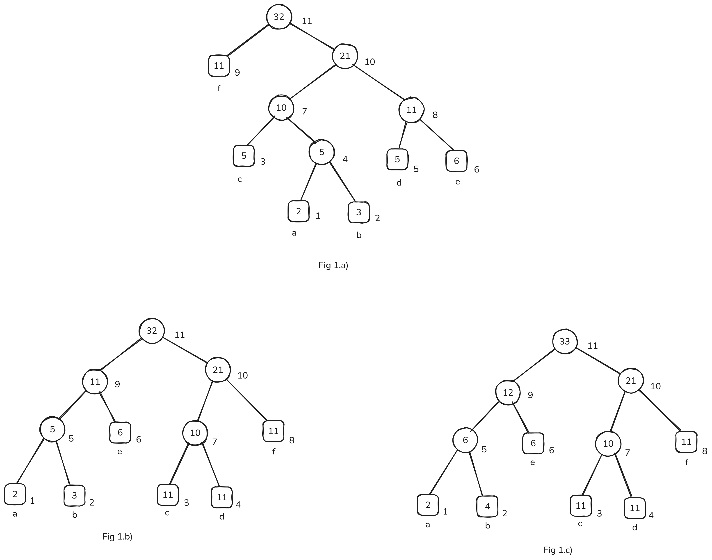

- ## Dynamic/Adaptive Huffman Coding
	- Motivation:
		- Huffman's algorithm requires two passes over the input sequence: once to calculate the frequencies (i.e probabilities) of each symbol in the sequence, and the second to build the Huffman tree using the probability distribution from the first pass.
	- Dynamic huffman coding instead uses a one pass encoding technique and hence runs faster.
	- Both the sender and receiver have the same initial state for the same sequence and hence are in sync, so the sender does not need to provide the tree to the receiver for the latter to be able to decode the encoded sequence, unlike the two pass method.
	- There exist two algorithms for dynamic huffman coding; FGK (Faller-Gallager-Knuth), and Vitter's algorithms. While they do have their differences (Vitters being the more optimal one with the downside of being slower), they share the same basic idea.
	- They do not use a static code based on a single binary tree, since they cannot make an initial pass to calculate the letter frequencies that would be required to build the Huffman tree.
	- Instead the coding is based on a dynamically varying Huffman tree, i.e, the tree used to process the (t + 1) letter in the Huffman tree with respect $$M_t$$.
	- The sender encodes the (t+1)st letter $$a_{i_{t}}$$ in the message by the sequences of 0s and 1s that specifies the path from the root to $$a_{i_{t}}$$'s leaf. The receiver then recovers the original letter by the corresponding traversal of its copy of the tree. Both sender and receiver then modify their copy of the tree at this point before proceeding to the next letter, after which it results in the Huffman tree for message $$M_t$$.
	- Such a Huffman tree of $p$ leaves needs to fulfill an important property, known as the **Sibling property** or the **Sibling rule**:
		- the $p$ leaves have non-negative weights $$w_1, w_2, ... w_p$$ and the weight of each interior node is the sum of the weights of its children
		- the nodes can be numbered in a nondecreasing order by weight, so that nodes $$2j-1$$ and $$2j$$ are siblings, for $$1 \le j \le p-1$$ and their common parent is higher in the number.
	- The node numbering corresponds to the order in which the nodes are combined by Huffman's algorithm.
	- Suppose that $$M_t = a_1, a_2, ...a_{i_t}$$ has already been processed. The next letter $$a_{i_{t+1}}$$ is encoded and decoding using a Huffman tree for $$M_{t+1}$$. We need to find a way to modify this tree quickly in order to produce a Huffman tree for $$M_{t+1}$$ for the next symbol to encode.
	- Consider an alphabet size $$t = 32$$, and an incoming symbol $$a_{i_{t+1}} = "b"$$. If we just simply increment the weight of the leaf node containing the symbol b and that of its ancestors, the tree would no longer satisfy the Sibling property and hence not be a Huffman tree, as node 4 would be updated to have weight 6 and the node immediately to its right i.e node 5 still a weight of 5. (Fig 1.a)
	- Vitter proposes a two phase solution to perform this update. It is two phase only for simplicity, it can be implemented as a single phase operation.
		- In phase 1, we intend to rearrange the nodes such that the weight of $$a_{i_{t+1}}$$ can be updated while still preserving the Sibling rule. We start by marking the leaf node of $$a_{i_{t+1}}$$ as the current node. We swap the contents of current node with the highest numbered node with the same weight, and then mark the parent of the latter as the new current node. This process is repeated until we reach the root node.
		- In phase 2, we simply increment the weight of the leaf node for $$a_{i_{t+1}}$$ and that of its ancestors.
	- The reason why the result tree is a Huffman tree for $$M_{t+1}$$ is twofold:
		- the numbering of the nodes is the same as it was prior to incrementing
		- incrementing still preserves the first condition of the Sibling rule. As we swap the current node with the highest numbered node of the same weight, we ensure that there exists no node to its right with equal weight. This lets us freely increment the weight of the current node and still satisfy the second condition of the Sibling rule.
	- The following figure (Fig 1) shows an example of the swap-and-increment operation.
		- 
	- A special pseudo-node, known as the 0-node or the NYT (not-yet-transferred) node is used to represent any unseen symbols in the tree, to ensure that each node has a sibling during insertion. When the (t+1)st node in the message is processed, if it does not already appear in $$M_{t+1}$$, the 0-node is split to create a leaf node for it, with its sibling becoming the 0-node.
- ## DEFLATE algorithm
	- Uses a combination of LZ77 and Huffman codes
	- #### Compressed Data format
		- The compressed data is broken up into blocks, each block containing a huffman tree and a portion of compressed data. The Huffman tree in each block is independent of those from other blocks, however the LZ77 compressed data can reference strings from a previous block upto 32K input bytes.
		- The LZ77 compressed data contains literal byte strings (i.e input data sequences that have not been seen before in the previous 32K bytes), and pointers to duplicated strings, represented by <length, backwards distance>. The distance is limited to 32K bytes and the length is limited to 258 bits.
		- The block size is not limited except in the case of data that is non-compressible, which has a limit of 65,535 bytes.
	- Deflate allows for multiple compression levels, according to the BFINAL header bit:
		- 00 - No compression
		- 01 - compressed with fixed Huffman codes
		- 10 - compressed with dynamic Huffman codes
	- Some additional rules for Huffman codes are:
		- Huffman codes of a given bit length are lexicographically consecutive, in the same order as the symbols they represent. Eg. 100 , 101, and 110 are lexicographically consecutive
		- Shorter codes lexicographically precede longer ones. Eg: 0 precedes 10 which precedes 110.
	- The encoded data blocks consist of sequences of symbols from 3 different alphabets defined for Deflate:
		- literal bytes, in the case of uncompressed data, or data that has not been seen before in the previous 32K bytes
		- from the alphabet of byte values (0..255)
		- or <length, backwards distance> pairs where the length is from the alphabet (3..258) and the distance is from (1..32,768).
	- The literal and length alphabets are merged into a single alphabet (0..258), where values from 0..255 represent the literal values, value 256 indicates an end-of-block, and values from 257-258 represent length codes (with some extra bits)
	-
- ### References
	- J.S Vitter. (1987). Design and Analysis of Dynamic Huffman Codes.  *Journal of the ACM, 34(4)*.
	  https://doi.org/10.1145/31846.42227
	- RFC-1951 - DEFLATE Compressed Data Format Specification v1.3. https://www.rfc-editor.org/rfc/rfc1951
